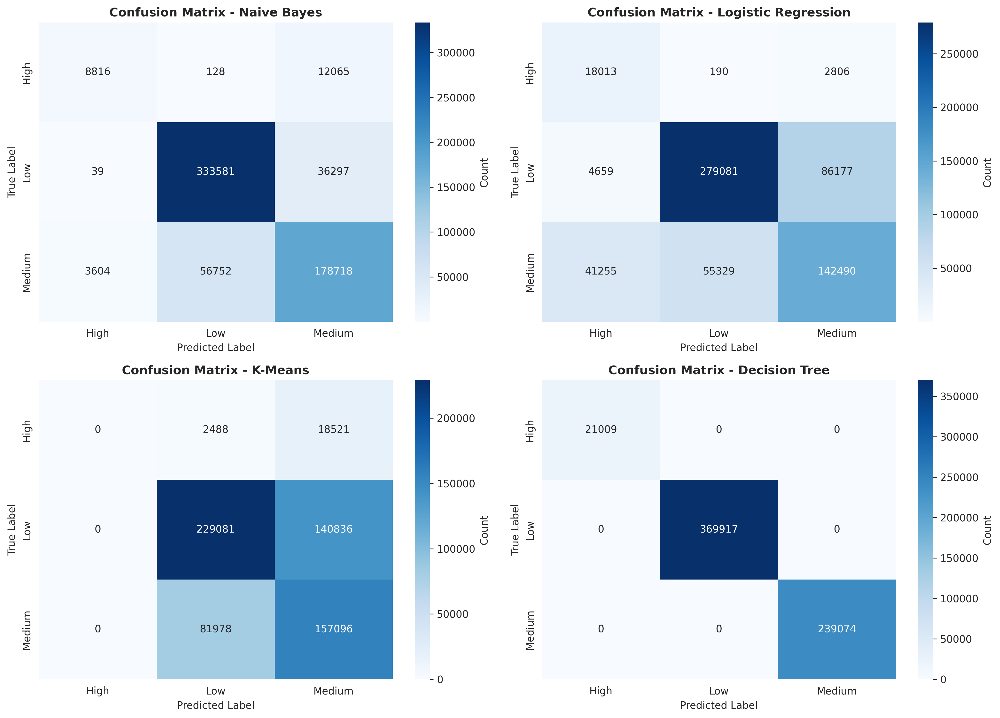
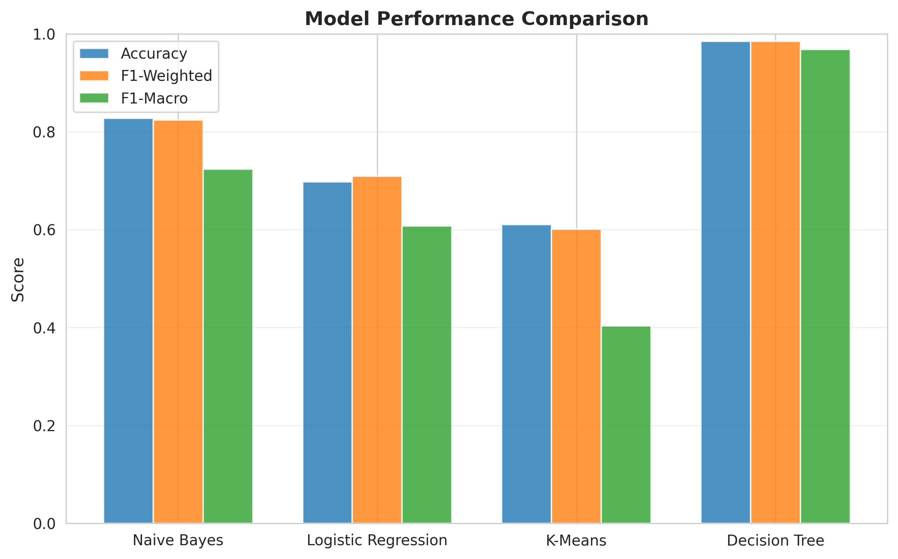

# Kaggle Competition Report


### Student Information
**Name**: Aly Muhammad Kazani \
**Roll No**: 24K-0512 \
**Section**: BCS-4E \
**Submission Date**: 23 April 2026


## Table of Contents
1. [Competition Overview](#1-competition-overview)
2. [Data Preprocessing](#2-data-preprocessing)
3. [Models Attempted](#3-models-attempted)
4. [Cross Validation Strategy](#4-cross-validation-strategy)
5. [Failed Attempts & Insights](#5-failed-attempts-and-insights)
6. [Final Model Selection](#6-final-model-selection)
7. [Leaderboard Performance](#7-leaderboard-performance)
8. [Conclusion and Learnings](#8-conclusion-and-learnings)

---

## 1. Competition Overview
   - **Competition Name**: Predicting Irrigation Need | Playground Series - Season 6 Episode 4
   - **Problem Type**: Multi-class classification (`Low`, `Medium`, `High`)
   - **Evaluation Metric**: Balanced accuracy (average of recall obtained on each class)
   - **Brief understanding of the dataset**:
        - *630,000* training samples with *12* numerical features and *8* categorical features.
        - **Target**: *Irrigation_Need* with three levels: `Low`, `Medium`, `High` – highly imbalanced \
          (Low dominates with *~369k* samples, Medium *~239k*, High *~21k*).
        - **Features** include `soil type`, `crop type`, `growth stage`, `season`, `irrigation type`, `water source`, `mulching usage`, `region`, and various numerical measurements.
        - No missing values in the provided data.

---

## 2. Data Preprocessing
   - **Missing values handling**: No missing values were present; no imputation required.
   - **Encoding techniques**: All 8 categorical features were label-encoded using *sklearn’s* `LabelEncoder` (integer mapping). The target variable was also label-encoded.
   - **Feature scaling**: `StandardScaler` applied to all numerical features (mean=0, std=1). Scaling was essential for distance-based models (K-Means, logistic regression) and for stable convergence.
   - **Train-validation split**: No fixed hold-out set was used. The entire training set was evaluated via 5-fold stratified cross-validation, ensuring each fold preserved the original class distribution. The final model was trained on the full training data.

---

## 3. Models Attempted
   - **Logistic Regression** (`baseline`, `multiclass`, `balanced class weights`)
   - **Gaussian Naïve Bayes**
   - **K-Means as a classifier** (custom: clusters voted by majority class)
   - **Decision Tree** (default and tuned versions, in separate runs)
   > No ensemble methods or neural networks were attempted in this iteration.

---

## 4. Cross Validation Strategy
   - **K-Fold details**: 5-fold *StratifiedKFold* with shuffle (random_state=1). Each fold preserved the original class proportions.
   - **LOOCV observations**: Leave-One-Out CV was not performed due to the large dataset (630,000 samples) making it computationally prohibitive.
   - **Best validation accuracy (average over 5 folds)**:
        - **Default Decision Tree**          → ~97.01% balanced accuracy (0.9701 weighted F1)
        - **Decision Tree (max_depth=10)**   → ~98% balanced accuracy (tuned)

   - **Other models’ validation metrics (before tuning)**:
        - **Naïve Bayes**:         accuracy ~83%, F1-weighted ~0.82
        - **Logistic Regression**: accuracy ~70%, F1-weighted ~0.71
        - **K-Means classifier**:  accuracy ~61%, F1-weighted ~0.60

---

## 5. Failed Attempts and Insights
   Model used: **Decision Tree (default hyperparameters)**

   - **Accuracy obtained on training data**: 100% \
   perfect classification report: 

```
            precision    recall  f1-score   support

High            1.00      1.00      1.00     21009
Low             1.00      1.00      1.00    369917
Medium          1.00      1.00      1.00    239074

accuracy                            1.00    630000
macro avg       1.00      1.00      1.00    630000
weighted avg    1.00      1.00      1.00    630000
```
 
  - **Cross-validation accuracy**: ~97.01% (weighted F1 0.9701)
    
  - **Confusion matrix (training set)**
    

  - **What went wrong?** \
      The unconstrained decision tree grew until every leaf was pure, memorising the training data entirely. The perfect training metrics concealed a 3% gap to the cross-validation score, a clear sign of **overfitting**.
  - **What was improved?** \
      To combat overfitting, the tree’s `max_depth` was limited to 10. This simple regularisation closed the gap, raised the cross-validation accuracy to ~*98%*, and gave a more reliable model that ultimately performed well on the public leaderboard (*0.95461* balanced accuracy).

  **Insight gained**: \
  Always compare training performance with out-of-fold validation. A perfect confusion matrix on the training set is a strong indicator of high variance.

---

## 6. Final Model Selection
  - **Best model**: Decision Tree with max_depth=10
  - **Hyperparameters**: max_depth=10, random_state=1 (all other parameters kept default)
  - **Why selected?**
    - After tuning, it gave the highest cross-validation balanced accuracy (~98%).
    - The depth constraint prevents memorisation while still capturing important non‑linear relationships.
    - It outperformed K-Means, Logistic Regression and Naïve Bayes by a comfortable margin.
  - **Models Comparison**:
  

---

## 7. Leaderboard Performance
  - **Kaggle score**: 0.95461 (balanced accuracy)
  - **Rank**: 2346
  

---

## 8. Conclusion and Learnings
  ### Key insights:
  - **Occam’s Razor in practice**: the simpler Gaussian Naïve Bayes model actually outperformed the more complex Logistic Regression on this dataset, reminding me that simplicity can sometimes yield better generalisation.
  - **Decision trees can easily overfit when left unconstrained**: regularisation via `max_depth` was essential to achieve a trustworthy validation score.
  - **Cross-validation is the honest measure of model performance**: training-set metrics can be misleading.
  - Even a non‑traditional classifier like K‑Means can serve as a meaningful baseline, though its performance was considerably lower here.
  - Feature scaling and proper encoding are critical for distance‑based and
    gradient‑based models.

  ### Challenges faced:
  - Identifying and mitigating overfitting in the decision tree (I thought the 100% training accuracy was an error).
  - Selecting the appropriate number of clusters (3) for the K‑Means classifier.
  - Balancing the heavily imbalanced classes without oversampling techniques.

  ### Future improvements:
  - Try other methods such as Random Forest, Gradient Boosting (XGBoost, LightGBM) which often excel on tabular data, or so I am told.
  - Explore feature engineering (interactions, polynomial features) and
    dimensionality reduction.
  - Use out‑of‑fold predictions (random sampling) to generate more realistic confusion matrices for all models.
